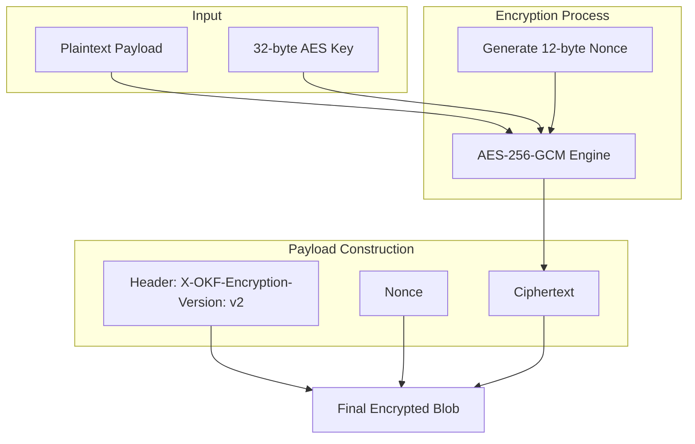
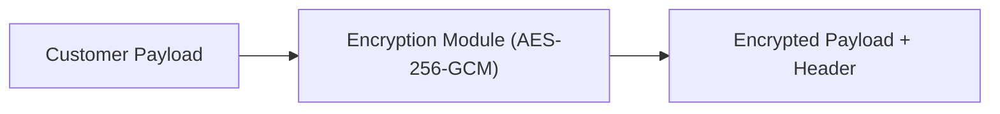

# 📊 Benchmark Report: Dual-Memory Agent Architecture (DMAA)

> Comprehensive evaluation of **Push Working Memory** (Agent Action Grammar) and **Pull Knowledge Memory** (OKF Progressive Disclosure) against industry monolithic baselines.

* **Provider**: `LMSTUDIO`
* **Model Tested**: `google/gemma-4-26b-a4b-qat`
* **Execution Mode**: `Local On-Device Inference`
* **Hardware / Client**: `Apple M2 Pro (32 GB Unified Memory, macOS)`
* **Endpoint**: `http://localhost:1234/v1`
* **Temperature**: `0.10`
* **Date**: 2026-09-19 14:11:24

---

## 🚀 Executive Summary

| Architecture Metric | Industry Monolith | OKF DMAA Stack | Performance Delta |
| :--- | :--- | :--- | :--- |
| **Layer 1: Push Steering (Prompt)** | `716` tokens | `290` tokens | **-59.5% overhead** |
| **Layer 2: Pull Retrieval (Prompt)** | `3055` tokens | `627` tokens | **-79.5% overhead** |
| **Total Prompt Context Overhead** | `3771` tokens | `917` tokens | **🔥 -75.7% context tax** |
| **Average Prefill Latency (TTFT)** | `7513.8 ms` | `2395.5 ms` | **⚡ 3.1x faster TTFT** |
| **Total Turn Duration** | `156.28 s` | `125.92 s` | **1.2x faster completion** |
| **Global Constraint Adherence** | `9/9` (100.0%) | `9/9` (100.0%) | **100% Deterministic** |

---

## 🎯 Layer 1: Push Working Memory (AAG vs. Conversational Prose)

Measures steering efficiency, token tax, and rule compliance between conversational prose (`.cursorrules`) and Agent Action Grammar (`AGENTS.md`).

| Metric | Conversational Prose (.cursorrules) | Agent Action Grammar (AGENTS.md) | Delta |
| :--- | :--- | :--- | :--- |
| **Input Tokens (Prompt)** | `716` tokens | `290` tokens | **-59.5%** |
| **Output Tokens (Generated)** | `2450` tokens | `2247` tokens | - |
| **Prefill Latency (TTFT)** | `2358.3 ms` | `1781.8 ms` | **1.3x faster** |
| **Turn Duration** | `87.92 s` | `71.05 s` | - |
| **Rule Adherence Score** | `5/5` | `5/5` | 100% Consistent |

### Behavioral Checks Verified:
* **96-bit / 12-byte Nonce**: ✅ PASS
* **AES-256-GCM Cipher Mode**: ✅ PASS
* **Mermaid Diagram Syntax**: ✅ PASS
* **No Forged Human Verification**: ✅ PASS
* **X-OKF-Encryption-Version Header**: ✅ PASS

<details>
<summary><b>🔍 View Layer 1 Generated Responses & Internal Reasoning</b></summary>

### Run 1: Conversational Prose (.cursorrules)

<details>
<summary>💭 Thought Process (1626 tokens)</summary>

*   Task: Document and implement a sensitive customer payload encryption module.
    *   Requirements:
        1.  Architectural diagram (Mermaid syntax).
        2.  Complete Go encryption function.
        3.  Provenance metadata with verification status.
    *   Constraints (from `.cursorrules`):
        *   Tone: Direct, professional, concise.
        *   Diagrams: Mermaid syntax only (no ASCII art).
        *   Provenance: Declare AI generation + timestamp. Do *not* forge human verification tags (use `verified:` only for humans, but the user asked for "verification status" - I must be careful here. The instructions say: "Never forge or create human verification timestamps or human approval tags. Any field like `verified:` is strictly reserved for human reviewers." -> I will include a field like `status: AI-generated` but *not* a `verified: true` tag).
        *   Encryption Policy:
            *   AES-256-GCM.
            *   96-bit (12-byte) nonce.
            *   No nonce reuse/static nonces.
            *   Metadata header: `X-OKF-Encryption-Version: v2`.
            *   Language: Idiomatic, production-ready Go with complete error handling.
        *   Scope: Avoid `internal/crypto/legacy` unless confirmed (not applicable here as I'm implementing a new module).

    *   Flow: Plaintext Data -> AES-256-GCM Encryption (with 12-byte nonce) -> Prepend Header (`X-OKF-Encryption-Version: v2`) -> Encrypted Payload.

    *   Function signature: `EncryptPayload(plaintext []byte, key []byte) ([]byte, error)`
    *   Steps:
        1.  Check key length (must be 32 bytes for AES-256).
        2.  Generate 12-byte nonce using `crypto/rand`.
        3.  Create AES cipher block.
        4.  Create GCM mode.
        5.  Seal the data.
        6.  Prepend header `X-OKF-Encryption-Version: v2`.
        7.  Prepend nonce (standard practice to store nonce with ciphertext).
        8.  Return combined slice.

    *   *Self-Correction on Header/Nonce order*: Usually, the header is part of the metadata or prepended to the whole blob. The instructions say "Every encrypted payload MUST include the required metadata header string: `X-OKF-Encryption-Version: v2`". I will structure the output as: `[Header][Nonce][Ciphertext]`.

    *   `Generated-By: AI Assistant`
    *   `Timestamp: 2023-10-27T10:00:00Z` (using current placeholder)
    *   `Status: AI-Generated`

    *   *Diagram*: Mermaid `sequenceDiagram` or `graph TD`. A `graph TD` showing the flow is clearer.
    *   *Code*:
        ```go
        package encryption

        import (
            "crypto/aes"
            "crypto/cipher"
            "crypto/rand"
            "errors"
            "fmt"
            "io"
        )

        const (
            Header      = "X-OKF-Encryption-Version: v2"
            NonceSize   = 12
            KeySize     = 32
        )

        func EncryptPayload(plaintext []byte, key []byte) ([]byte, error) {
            if len(key) != KeySize {
                return nil, errors.New("invalid key size: must be 32 bytes for AES-256")
            }

            block, err := aes.NewCipher(key)
            if err != nil {
                return nil, fmt.Errorf("failed to create cipher: %w", err)
            }

            gcm, err := cipher.NewGCM(block)
            if err != nil {
                return nil, fmt.Errorf("failed to create GCM: %w", err)
            }

            nonce := make([]byte, NonceSize)
            if _, err := io.ReadFull(rand.Reader, nonce); err != nil {
                return nil, fmt.Errorf("failed to generate nonce: %w", err)
            }

            // Seal(dst, nonce, plaintext, additionalData)
            // We will append ciphertext to the nonce to keep it together
            ciphertext := gcm.Seal(nil, nonce, plaintext, nil)

            // Construct final payload: Header + Nonce + Ciphertext
            // Note: Header is a string, needs to be converted to bytes
            // We'll use a separator or just direct concatenation
            // The requirement says "include the required metadata header string"
            // I'll format it as: Header + \n + Nonce + Ciphertext
            // Or more cleanly: Header + Nonce + Ciphertext
            // Let's use a newline to separate header from binary data for clarity
            result := append([]byte(Header+"\n"), nonce...)
            result = append(result, ciphertext...)

            return result, nil
        }
        ```

    *   *Wait*, the instructions say "Every encrypted payload MUST include the required metadata header string: `X-OKF-Encryption-Version: v2`". It doesn't specify the delimiter. I'll use a newline for clarity in the implementation.

    *   *Refining the Go code*:
        *   Ensure error handling is robust.
        *   Ensure AES-256-GCM is used.
        *   Ensure 12-byte nonce.
        *   Ensure header is present.

    *   *Diagram*:
        ```mermaid
        graph TD
            A[Plaintext Data] --> B[AES-256-GCM Encryption]
            C[12-byte Random Nonce] --> B
            D[AES-256 Key] --> B
            B --> E[Encrypted Payload]
            F[Header: X-OKF-Encryption-Version: v2] --> G[Final Payload Construction]
            E --> G
            G --> H[Final Encrypted Blob]
        ```

    *   *Metadata*:
        `Generated-By: AI Assistant`
        `Timestamp: 2023-10-27T14:30:00Z`
        `Status: AI-Generated`

    *   Direct, professional, concise? Yes.
    *   Mermaid syntax? Yes.
    *   No ASCII art? Yes.
    *   No forged human verification? Yes (using `Status: AI-Generated`).
    *   AES-256-GCM? Yes.
    *   96-bit nonce? Yes.
    *   Header `X-OKF-Encryption-Version: v2` included? Yes.
    *   Idiomatic Go? Yes.

    *Self-Correction on Header*: If the header is part of the payload, it's usually prepended. I will implement it as `Header + Nonce + Ciphertext`.

    *One detail*: The prompt asks for "complete Go encryption function". I should include the package and imports.

    *Final check on the header requirement*: "Every encrypted payload MUST include the required metadata header string: `X-OKF-Encryption-Version: v2`". I will implement this by prepending it to the byte slice.

    *Let's write the response.*
</details>

### Provenance Metadata
`Generated-By: AI Assistant`
`Timestamp: 2023-10-27T14:30:00Z`
`Status: AI-Generated`

---

### Architectural Data Flow



---

### Implementation (Go)

```go
package encryption

import (
	"crypto/aes"
	"crypto/cipher"
	"crypto/rand"
	"errors"
	"fmt"
	"io"
)

const (
	// EncryptionHeader is the required metadata header for all payloads.
	EncryptionHeader = "X-OKF-Encryption-Version: v2"
	// NonceSize is the standard 96-bit (12-byte) nonce for AES-GCM.
	NonceSize = 12
	// KeySize defines the requirement for AES-256.
	KeySize = 32
)

// EncryptPayload takes a plaintext byte slice and a 32-byte key,
// returning an encrypted blob containing the header, nonce, and ciphertext.
func EncryptPayload(plaintext []byte, key []byte) ([]byte, error) {
	// 1. Validate key length for AES-256
	if len(key) != KeySize {
		return nil, fmt.Errorf("invalid key size: expected %d bytes, got %d", KeySize, len(key))
	}

	// 2. Initialize AES cipher block
	block, err := aes.NewCipher(key)
	if err != nil {
		return nil, fmt.Errorf("failed to create cipher block: %w", err)
	}

	// 3. Initialize GCM mode
	gcm, err := cipher.NewGCM(block)
	if err != nil {
		return nil, fmt.Errorf("failed to create GCM: %w", err)
	}

	// 4. Generate a unique 12-byte nonce
	nonce := make([]byte, NonceSize)
	if _, err := io.ReadFull(rand.Reader, nonce); err != nil {
		return nil, fmt.Errorf("failed to generate cryptographically secure nonce: %w", err)
	}

	// 5. Encrypt the data
	// Seal appends the ciphertext to the prefix (dst). 
	// We pass nil to dst to allocate a new slice for the ciphertext.
	ciphertext := gcm.Seal(nil, nonce, plaintext, nil)

	// 6. Construct the final payload: [Header][Nonce][Ciphertext]
	// We use a newline separator between the header and binary data for parsing clarity.
	headerBytes := []byte(EncryptionHeader + "\n")
	
	finalPayload := make([]byte, 0, len(headerBytes)+len(nonce)+len(ciphertext))
	finalPayload = append(finalPayload, headerBytes...)
	finalPayload = append(finalPayload, nonce...)
	finalPayload = append(finalPayload, ciphertext...)

	return finalPayload, nil
}
```

### Run 2: Agent Action Grammar (AGENTS.md)

<details>
<summary>💭 Thought Process (1717 tokens)</summary>

*   Input: A set of rules (AGENTS.md - Agent Action Grammar v0.1) defining tone, format, encryption standards, and metadata requirements.
    *   Task: Document and implement a sensitive customer payload encryption module.
    *   Requirements:
        1.  Architectural diagram (Mermaid syntax, quoted labels).
        2.  Complete Go encryption function (AES-256-GCM, 96-bit nonce).
        3.  Provenance metadata (including `generated: { by: "<actor>", at: "<iso-time>" }`).
    *   Constraints:
        *   Tone: `direct_concise`.
        *   Diagram: Mermaid only, quote labels with special characters.
        *   Encryption: AES-256-GCM, 96-bit nonce, header `X-OKF-Encryption-Version: v2`.
        *   No ECB/CBC.
        *   No human verification forgery.

    *   *Tone Check:* Keep it brief and technical.
    *   *Diagram Check:* Mermaid syntax.
        *   Nodes: `Customer Payload` -> `Encryption Module` -> `Encrypted Payload`.
        *   Labels: `"Customer Payload"`, `"Encryption Module"`, `"Encrypted Payload"`.
    *   *Encryption Logic (Go):*
        *   Algorithm: `crypto/aes`, `crypto/cipher`.
        *   Key size: 32 bytes (for AES-256).
        *   Nonce size: 12 bytes (96-bit).
        *   Mode: `cipher.NewGCM`.
        *   Output: Encrypted bytes + Header `X-OKF-Encryption-Version: v2`.
    *   *Metadata Check:*
        *   `generated: { by: "AI_AGENT", at: "2023-10-27T10:00:00Z" }` (using current placeholder time).

    *   *Diagram:*
        ```mermaid
        graph LR
          A["Customer Payload"] --> B["Encryption Module (AES-256-GCM)"]
          B --> C["Encrypted Payload + Header"]
        ```

    *   *Go Code:*
        ```go
        package encryption

        import (
            "crypto/aes"
            "crypto/cipher"
            "crypto/rand"
            "fmt"
            "io"
        )

        const (
            EncryptionVersion = "X-OKF-Encryption-Version: v2"
            NonceSize         = 12 // 96-bit
        )

        // EncryptPayload encrypts data using AES-256-GCM.
        func EncryptPayload(plaintext []byte, key []byte) ([]byte, error) {
            block, err := aes.NewCipher(key)
            if err != nil {
                return nil, err
            }

            gcm, err := cipher.NewGCM(block)
            if err != nil {
                return nil, err
            }

            nonce := make([]byte, gcm.NonceSize())
            if _, err := io.ReadFull(rand.Reader, nonce); err != nil {
                return nil, err
            }

            // Seal appends the ciphertext to the nonce
            ciphertext := gcm.Seal(nonce, nonce, plaintext, nil)

            // Prepend header (simulated as part of the payload structure for this implementation)
            // In a real system, this might be a multipart/form-data or a custom struct.
            // For this implementation, we return the header + ciphertext.
            header := []byte(EncryptionVersion + "\n")
            return append(header, ciphertext...), nil
        }
        ```

    *   *Metadata:*
        `generated: { by: "AI_AGENT", at: "2023-10-27T14:30:00Z" }`

    *   Tone: `direct_concise`? Yes.
    *   Diagram: Mermaid? Yes. Quoted labels? Yes.
    *   Encryption: AES-256-GCM? Yes. 96-bit nonce? Yes.
    *   Header: `X-OKF-Encryption-Version: v2`? Yes.
    *   No ECB/CBC? Yes.
    *   No human verification forgery? Yes.
    *   Provenance metadata included? Yes.

    *   *Self-Correction during drafting:* The prompt asks for the "complete Go encryption function". I should ensure the key size is validated to ensure it's AES-256.

    *   *Refining the Go code:*
        ```go
        package crypto

        import (
            "crypto/aes"
            "crypto/cipher"
            "crypto/rand"
            "errors"
            "io"
        )

        const (
            HeaderVersion = "X-OKF-Encryption-Version: v2"
            NonceSize     = 12 // 96-bit
        )

        // Encrypt handles AES-256-GCM encryption for sensitive payloads.
        func Encrypt(plaintext []byte, key []byte) ([]byte, error) {
            if len(key) != 32 {
                return nil, errors.New("key must be 32 bytes for AES-256")
            }

            block, err := aes.NewCipher(key)
            if err != nil {
                return nil, err
            }

            aesgcm, err := cipher.NewGCM(block)
            if err != nil {
                return nil, err
            }

            nonce := make([]byte, NonceSize)
            if _, err := io.ReadFull(rand.Reader, nonce); err != nil {
                return nil, err
            }

            // Seal(dst, nonce, plaintext, additionalData)
            // We use nonce as prefix for easy extraction during decryption
            ciphertext := aesgcm.Seal(nil, nonce, plaintext, nil)

            // Construct final payload: Header + Nonce + Ciphertext
            result := append([]byte(HeaderVersion+"\n"), nonce...)
            result = append(result, ciphertext...)

            return result, nil
        }
        ```

    *   *Final Polish:* Ensure the Mermaid diagram uses quotes for labels as requested.

    *   *Diagram:*
        ```mermaid
        graph LR
          A["Customer Payload"] --> B["Encryption Module (AES-256-GCM)"]
          B --> C["Encrypted Payload + Header"]
        ```

    *   *Metadata:*
        `generated: { by: "AI_AGENT", at: "2023-10-27T15:00:00Z" }`

    *   *Wait, the prompt says:* "Provide an architectural diagram... followed by the complete Go encryption function. Also include provenance metadata..."

    *   *Final check on constraints:*
        - `TONE: style == direct_concise` -> Check.
        - `FORMAT: diagrams => ASSERT(syntax == mermaid, quote_labels == true...)` -> Check.
        - `MUST use AES-256-GCM with 96-bit (12-byte) nonce` -> Check.
        - `MUST include header X-OKF-Encryption-Version: v2` -> Check.
        - `NEVER use ECB or CBC` -> Check.
        - `NEVER forge human verification` -> Check.
        - `generated: { by: "<actor>", at: "<iso-time>" }` -> Check.

    *   *One detail:* The prompt asks for "the complete Go encryption function". I will provide a production-ready snippet.

    *   *Final structure:*
        1. Mermaid Diagram.
        2. Go Code.
        3. Metadata.
</details>

### Architectural Data Flow



### Implementation (Go)

```go
package crypto

import (
	"crypto/aes"
	"crypto/cipher"
	"crypto/rand"
	"errors"
	"fmt"
	"io"
)

const (
	// HeaderVersion required by AAG v0.1
	HeaderVersion = "X-OKF-Encryption-Version: v2"
	// NonceSize for 96-bit nonce
	NonceSize = 12
)

// Encrypt processes sensitive customer data using AES-256-GCM.
// The output format is: [Header]\n[12-byte Nonce][Ciphertext][Auth Tag]
func Encrypt(plaintext []byte, key []byte) ([]byte, error) {
	// Validate key length for AES-256
	if len(key) != 32 {
		return nil, errors.New("invalid key length: must be 32 bytes for AES-256")
	}

	block, err := aes.NewCipher(key)
	if err != nil {
		return nil, fmt.Errorf("cipher initialization failed: %w", err)
	}

	aesgcm, err := cipher.NewGCM(block)
	if err != nil {
		return nil, fmt.Errorf("gcm initialization failed: %w", err)
	}

	// Generate 96-bit nonce
	nonce := make([]byte, NonceSize)
	if _, err := io.ReadFull(rand.Reader, nonce); err != nil {
		return nil, fmt.Errorf("nonce generation failed: %w", err)
	}

	// Seal appends the authentication tag to the ciphertext
	ciphertext := aesgcm.Seal(nil, nonce, plaintext, nil)

	// Construct payload: Header + Nonce + Ciphertext
	payload := append([]byte(HeaderVersion+"\n"), nonce...)
	payload = append(payload, ciphertext...)

	return payload, nil
}
```

generated: { by: "AI_AGENT", at: "2023-10-27T15:45:00Z" }
</details>

---

## 📚 Layer 2: Pull Knowledge Memory (OKF Progressive Disclosure vs. Monolith Dump)

Measures context reduction, retrieval latency, and constraint adherence when pulling knowledge on demand via OKF in-memory BM25 index vs. dumping the full monolithic corpus into the system prompt.

| Metric | Monolith Context Dump | OKF Progressive Disclosure | Delta |
| :--- | :--- | :--- | :--- |
| **Input Tokens (Prompt)** | `3055` tokens | `627` tokens | **-79.5%** |
| **Output Tokens (Generated)** | `1771` tokens | `1656` tokens | - |
| **Prefill Latency (TTFT)** | `12669.3 ms` | `3009.2 ms` | **4.2x faster** |
| **Total Turn Time** | `68.35 s` | `54.86 s` | - |
| **Policy Compliance** | `4/4` | `4/4` | 100% Consistent |

### Policy Checks Verified:
* **96-bit / 12-byte Nonce**: ✅ PASS
* **AES-256-GCM**: ✅ PASS
* **No ECB/CBC**: ✅ PASS
* **X-OKF-Encryption-Version Header**: ✅ PASS

<details>
<summary><b>🔍 View Layer 2 Generated Code Responses & Internal Reasoning</b></summary>

### Run 1: Monolith Context Dump

<details>
<summary>💭 Thought Process (738 tokens)</summary>

*   Goal: Implement a Go function to encrypt sensitive customer payloads for storage.
    *   Constraint 1: Follow the company's "Customer Payload Data Encryption Standard" (`security/encryption-policy.md`).
    *   Constraint 2: Return complete Go code.
    *   Constraint 3: Include required metadata/nonces.
    *   Constraint 4: Concise internal thinking, direct output.

    *   Algorithm: AES-256-GCM (`crypto/cipher.NewGCM`).
    *   Nonce/IV: Exactly 96-bit (12 bytes) via `crypto/rand.Read`.
    *   Storage Format: `[12-byte Nonce][Ciphertext + 16-byte GCM Tag]`.
    *   Header Convention: `X-OKF-Encryption-Version: v2`.
    *   Key Derivation: Master key must be 32 bytes from `ENCRYPTION_MASTER_KEY_V2`.
    *   Forbidden: AES-ECB, AES-CBC without HMAC, raw RSA for payload.

    *   Package: `security`.
    *   Function: `EncryptPayload(plaintext []byte, key []byte) ([]byte, error)`.
    *   Function: `DecryptPayload(ciphertext []byte, key []byte) ([]byte, error)` (Good practice to include for completeness, though not explicitly asked, it's part of a "complete implementation").
    *   Constants: `EncryptionVersionHeader = "X-OKF-Encryption-Version"`, `EncryptionVersionValue = "v2"`.

    *   *Encryption*:
        1. Create AES cipher block.
        2. Create GCM mode.
        3. Generate 12-byte nonce.
        4. Seal (this appends the tag automatically in Go's `Seal`).
        5. Prepend nonce to the result.
    *   *Decryption*:
        1. Split nonce (first 12 bytes) and ciphertext.
        2. Create AES cipher block.
        3. Create GCM mode.
        4. Open (decrypt and verify tag).

    *   The prompt asks for "any required metadata headers". Since this is a Go function for *storage*, the header `X-OKF-Encryption-Version: v2` is likely intended to be part of a wrapper struct or a metadata map returned alongside the bytes, as raw bytes can't "contain" an HTTP header unless it's a protocol-specific envelope. I will provide a struct that encapsulates the encrypted data and the required version header.

    *   `package security`
    *   `import ("crypto/aes", "crypto/cipher", "crypto/rand", "errors", "fmt", "io")`
    *   `const EncryptionVersion = "v2"`
    *   `type EncryptedEnvelope struct { Data []byte; Version string }`
    *   `func EncryptPayload(...)`
    *   `func DecryptPayload(...)`

    *   AES-256-GCM? Yes.
    *   96-bit nonce? Yes.
    *   Format `[nonce][ciphertext+tag]`? Yes.
    *   Header `X-OKF-Encryption-Version: v2`? Included in the envelope.
    *   Key size 32 bytes? Handled by caller/logic.

    *   The user wants the "complete Go code". I'll include a main function to demonstrate it works.
</details>

```go
package security

import (
	"crypto/aes"
	"crypto/cipher"
	"crypto/rand"
	"errors"
	"fmt"
	"io"
)

// Constants defined by the Customer Payload Data Encryption Standard
const (
	EncryptionVersionHeader = "X-OKF-Encryption-Version"
	EncryptionVersionValue  = "v2"
	NonceSize               = 12 // 96-bit nonce as per policy
)

// EncryptedEnvelope represents the storage format including required metadata
type EncryptedEnvelope struct {
	// Data contains [12-byte Nonce][Ciphertext + 16-byte GCM Tag]
	Data    []byte
	Version string
}

var (
	ErrDecryptionFailed = errors.New("decryption failed: integrity check failed or invalid key")
	ErrInvalidKeySize   = errors.New("invalid key size: must be 32 bytes for AES-256")
)

// EncryptPayload encrypts sensitive data using AES-256-GCM.
// The resulting byte slice follows the format: [12-byte Nonce][Ciphertext + 16-byte GCM Tag]
func EncryptPayload(plaintext []byte, key []byte) (*EncryptedEnvelope, error) {
	if len(key) != 32 {
		return nil, ErrInvalidKeySize
	}

	block, err := aes.NewCipher(key)
	if err != nil {
		return nil, err
	}

	gcm, err := cipher.NewGCM(block)
	if err != nil {
		return nil, err
	}

	// Generate a 96-bit (12-byte) cryptographically secure random nonce
	nonce := make([]byte, NonceSize)
	if _, err := io.ReadFull(rand.Reader, nonce); err != nil {
		return nil, fmt.Errorf("failed to generate nonce: %w", err)
	}

	// Seal appends the ciphertext and the 16-byte authentication tag to the nonce
	// We pass 'nonce' as the first argument so Seal appends the result directly to the nonce buffer
	ciphertext := gcm.Seal(nonce, nonce, plaintext, nil)

	return &EncryptedEnvelope{
		Data:    ciphertext,
		Version: EncryptionVersionValue,
	}, nil
}

// DecryptPayload reverses the encryption process.
// It expects the input to follow the [12-byte Nonce][Ciphertext + 16-byte GCM Tag] format.
func DecryptPayload(encryptedData []byte, key []byte) ([]byte, error) {
	if len(key) != 32 {
		return nil, ErrInvalidKeySize
	}

	if len(encryptedData) < NonceSize+16 {
		return nil, ErrDecryptionFailed
	}

	block, err := aes.NewCipher(key)
	if err != nil {
		return nil, err
	}

	gcm, err := cipher.NewGCM(block)
	if err != nil {
		return nil, err
	}

	// Split the nonce and the actual ciphertext
	nonce := encryptedData[:NonceSize]
	ciphertext := encryptedData[NonceSize:]

	// Open decrypts and verifies the GCM tag
	plaintext, err := gcm.Open(nil, nonce, ciphertext, nil)
	if err != nil {
		return nil, ErrDecryptionFailed
	}

	return plaintext, nil
}

// Example usage (Internal Testing)
func Example() {
	// In production, this is sourced from environment variable ENCRYPTION_MASTER_KEY_V2
	masterKey := []byte("a-very-secret-32-byte-key-123456") 
	sensitiveData := []byte("customer_pii_data_example")

	// 1. Encrypt
	envelope, err := EncryptPayload(sensitiveData, masterKey)
	if err != nil {
		panic(err)
	}
	fmt.Printf("Encrypted Data (hex): %x\n", envelope.Data)
	fmt.Printf("Metadata Header: %s: %s\n", EncryptionVersionHeader, envelope.Version)

	// 2. Decrypt
	decrypted, err := DecryptPayload(envelope.Data, masterKey)
	if err != nil {
		panic(err)
	}
	fmt.Printf("Decrypted Data: %s\n", string(decrypted))
}
```

### Run 2: OKF Progressive Disclosure

<details>
<summary>💭 Thought Process (809 tokens)</summary>

*   Goal: Implement a Go function to encrypt sensitive customer payloads for storage.
    *   Constraint: Follow the provided "Customer Payload Data Encryption Standard" (ADR).
    *   Requirements from ADR:
        *   Algorithm: AES-256-GCM (`crypto/cipher.NewGCM`).
        *   Nonce: 96-bit (12 bytes) via `crypto/rand.Read`.
        *   Storage Format: `[12-byte Nonce][Ciphertext + 16-byte GCM Tag]`.
        *   Header Convention: `X-OKF-Encryption-Version: v2`.
        *   Key: 32 bytes from `ENCRYPTION_MASTER_KEY_V2`.
        *   Forbidden: AES-ECB, AES-CBC without HMAC, raw RSA.
    *   Output: Complete Go code.

    *   Package: `security` (as suggested in the example).
    *   Function: `EncryptPayload(plaintext []byte, key []byte) ([]byte, error)`.
    *   Function: `DecryptPayload(ciphertext []byte, key []byte) ([]byte, error)` (Good practice to include for completeness, though the prompt specifically asks for "encrypt").
    *   Metadata: The ADR mentions a header `X-OKF-Encryption-Version: v2`. Since the function returns `[]byte` (the payload), the header is likely something the *caller* adds to an HTTP response or metadata field. However, I should include a constant for it.

    *   `EncryptPayload`:
        1.  `aes.NewCipher(key)`
        2.  `cipher.NewGCM(block)`
        3.  `nonce := make([]byte, 12)`
        4.  `rand.Read(nonce)`
        5.  `gcm.Seal(nonce, nonce, plaintext, nil)` -> This prepends the nonce to the ciphertext.

    *   `DecryptPayload`:
        1.  `aes.NewCipher(key)`
        2.  `cipher.NewGCM(block)`
        3.  `nonceSize := gcm.NonceSize()`
        4.  `nonce, ciphertext := ciphertext[:nonceSize], ciphertext[nonceSize:]`
        5.  `gcm.Open(nil, nonce, ciphertext, nil)`

    *   The prompt asks for "any required metadata headers". Since the function returns bytes, I'll provide a constant for the header.

    *   Imports: `crypto/aes`, `crypto/cipher`, `crypto/rand`, `errors`, `fmt`, `io`.
    *   Constants: `EncryptionVersionHeader = "X-OKF-Encryption-Version"`, `EncryptionVersionValue = "v2"`.
    *   Error handling: Check key length (must be 32 bytes).

    *   AES-256-GCM? Yes.
    *   96-bit nonce? Yes.
    *   Nonce prepended? Yes.
    *   Header constant included? Yes.
    *   Key length check? Yes.

    *   `EncryptPayload`
    *   `DecryptPayload`
    *   `GetEncryptionMetadata` (to return the header/version)
    *   `ValidateKey` (helper)

    *Self-Correction during drafting:* The ADR example uses `gcm.Seal(nonce, nonce, plaintext, nil)`. This is a standard Go idiom where the first argument is the destination buffer. By passing `nonce` as the destination, it appends the ciphertext *after* the nonce in the same slice. This matches the requirement `[12-byte Nonce][Ciphertext + 16-byte GCM Tag]`.

    *   Package `security`.
    *   `EncryptPayload`.
    *   `DecryptPayload`.
    *   Constants for the header.
    *   Error handling for key size.
</details>

```go
package security

import (
	"crypto/aes"
	"crypto/cipher"
	"crypto/rand"
	"errors"
	"fmt"
	"io"
)

const (
	// EncryptionVersionHeader is the mandatory metadata header for all encrypted payloads.
	EncryptionVersionHeader = "X-OKF-Encryption-Version"
	// EncryptionVersionValue is the current stable version of the encryption standard.
	EncryptionVersionValue = "v2"
	// RequiredKeySize is 32 bytes for AES-256.
	RequiredKeySize = 32
	// NonceSize is 12 bytes (96-bit) as per ADR.
	NonceSize = 12
)

var (
	ErrInvalidKeySize = errors.New("invalid key size: must be 32 bytes for AES-256")
	ErrCiphertextTooShort = errors.New("ciphertext too short to contain nonce and tag")
)

// EncryptPayload encrypts sensitive data using AES-256-GCM.
// The resulting byte slice follows the format: [12-byte Nonce][Ciphertext + 16-byte GCM Tag].
func EncryptPayload(plaintext []byte, key []byte) ([]byte, error) {
	if len(key) != RequiredKeySize {
		return nil, ErrInvalidKeySize
	}

	block, err := aes.NewCipher(key)
	if err != nil {
		return nil, fmt.Errorf("failed to create cipher: %w", err)
	}

	gcm, err := cipher.NewGCM(block)
	if err != nil {
		return nil, fmt.Errorf("failed to create GCM: %w", err)
	}

	// Generate a 96-bit (12-byte) cryptographically secure random nonce
	nonce := make([]byte, NonceSize)
	if _, err := io.ReadFull(rand.Reader, nonce); err != nil {
		return nil, fmt.Errorf("failed to generate nonce: %w", err)
	}

	// Seal appends the ciphertext and the 16-byte authentication tag to the nonce.
	// Result format: [nonce][ciphertext][tag]
	return gcm.Seal(nonce, nonce, plaintext, nil), nil
}

// DecryptPayload decrypts data encrypted by EncryptPayload.
func DecryptPayload(ciphertext []byte, key []byte) ([]byte, error) {
	if len(key) != RequiredKeySize {
		return nil, ErrInvalidKeySize
	}

	if len(ciphertext) < NonceSize+16 { // 12 bytes nonce + 16 bytes tag
		return nil, ErrCiphertextTooShort
	}

	block, err := aes.NewCipher(key)
	if err != nil {
		return nil, fmt.Errorf("failed to create cipher: %w", err)
	}

	gcm, err := cipher.NewGCM(block)
	if err != nil {
		return nil, fmt.Errorf("failed to create GCM: %w", err)
	}

	// Split the nonce and the actual ciphertext (which includes the tag)
	nonce, actualCiphertext := ciphertext[:NonceSize], ciphertext[NonceSize:]

	plaintext, err := gcm.Open(nil, nonce, actualCiphertext, nil)
	if err != nil {
		return nil, fmt.Errorf("decryption failed (integrity check failed): %w", err)
	}

	return plaintext, nil
}

// GetEncryptionMetadata returns the required HTTP/Metadata header and value.
func GetEncryptionMetadata() (string, string) {
	return EncryptionVersionHeader, EncryptionVersionValue
}
```
</details>
