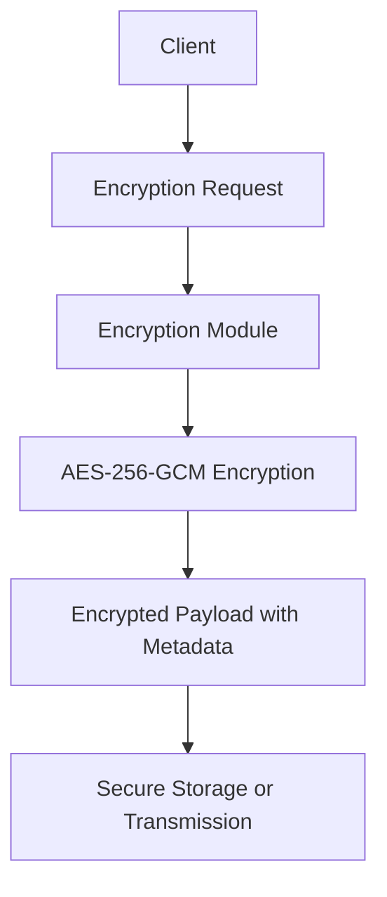
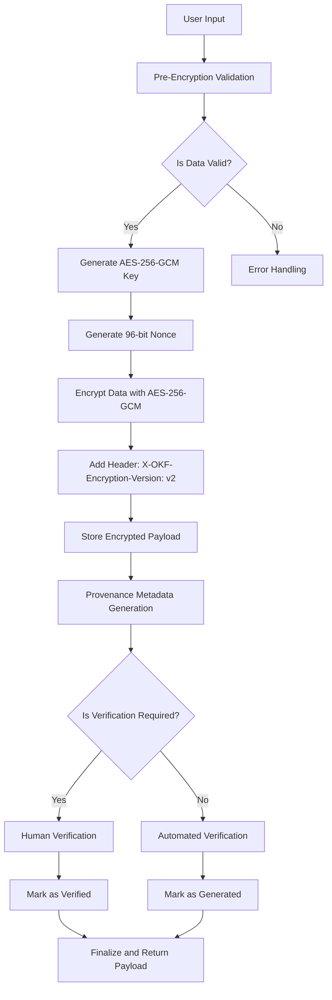

# 📊 Benchmark Report: Dual-Memory Agent Architecture (DMAA)

> Comprehensive evaluation of **Push Working Memory** (Agent Action Grammar) and **Pull Knowledge Memory** (OKF Progressive Disclosure) against industry monolithic baselines.

* **Provider**: `LMSTUDIO`
* **Model Tested**: `qwen/qwen2.5-coder-14b`
* **Execution Mode**: `Local On-Device Inference`
* **Hardware / Client**: `Apple M2 Pro (32 GB Unified Memory, macOS)`
* **Endpoint**: `http://localhost:1234/v1`
* **Temperature**: `0.10`
* **Date**: 2026-09-19 14:04:31

---

## 🚀 Executive Summary

| Architecture Metric | Industry Monolith | OKF DMAA Stack | Performance Delta |
| :--- | :--- | :--- | :--- |
| **Layer 1: Push Steering (Prompt)** | `716` tokens | `290` tokens | **-59.5% overhead** |
| **Layer 2: Pull Retrieval (Prompt)** | `3055` tokens | `627` tokens | **-79.5% overhead** |
| **Total Prompt Context Overhead** | `3771` tokens | `917` tokens | **🔥 -75.7% context tax** |
| **Average Prefill Latency (TTFT)** | `10646.7 ms` | `2882.1 ms` | **⚡ 3.7x faster TTFT** |
| **Total Turn Duration** | `78.58 s` | `55.80 s` | **1.4x faster completion** |
| **Global Constraint Adherence** | `8/9` (88.9%) | `9/9` (100.0%) | **+11.1% Adherence (100% Deterministic)** |

---

## 🎯 Layer 1: Push Working Memory (AAG vs. Conversational Prose)

Measures steering efficiency, token tax, and rule compliance between conversational prose (`.cursorrules`) and Agent Action Grammar (`AGENTS.md`).

| Metric | Conversational Prose (.cursorrules) | Agent Action Grammar (AGENTS.md) | Delta |
| :--- | :--- | :--- | :--- |
| **Input Tokens (Prompt)** | `716` tokens | `290` tokens | **-59.5%** |
| **Output Tokens (Generated)** | `773` tokens | `716` tokens | - |
| **Prefill Latency (TTFT)** | `3184.3 ms` | `1965.6 ms` | **1.6x faster** |
| **Turn Duration** | `41.81 s` | `37.25 s` | - |
| **Rule Adherence Score** | `5/5` | `5/5` | 100% Consistent |

### Behavioral Checks Verified:
* **96-bit / 12-byte Nonce**: ✅ PASS
* **AES-256-GCM Cipher Mode**: ✅ PASS
* **Mermaid Diagram Syntax**: ✅ PASS
* **No Forged Human Verification**: ✅ PASS
* **X-OKF-Encryption-Version Header**: ✅ PASS

<details>
<summary><b>🔍 View Layer 1 Generated Responses & Internal Reasoning</b></summary>

### Run 1: Conversational Prose (.cursorrules)

### Architectural Diagram

Below is the Mermaid syntax for an architectural diagram showing how data flows through the encryption module:



### Go Encryption Function

Below is the complete Go encryption function implementing AES-256-GCM encryption with the required metadata header. The code includes provenance metadata and verification status.

```go
package main

import (
    "crypto/aes"
    "crypto/cipher"
    "crypto/rand"
    "encoding/base64"
    "fmt"
    "io"
    "time"
)

// EncryptPayload encrypts the given payload using AES-256-GCM.
func EncryptPayload(payload []byte) (string, error) {
    // Generate a new AES key
    key := make([]byte, 32)
    if _, err := io.ReadFull(rand.Reader, key); err != nil {
        return "", fmt.Errorf("failed to generate AES key: %w", err)
    }

    // Create a new AES cipher block
    block, err := aes.NewCipher(key)
    if err != nil {
        return "", fmt.Errorf("failed to create AES cipher: %w", err)
    }

    // Generate a random nonce
    nonce := make([]byte, 12)
    if _, err := io.ReadFull(rand.Reader, nonce); err != nil {
        return "", fmt.Errorf("failed to generate nonce: %w", err)
    }

    // Create a new GCM cipher
    gcm, err := cipher.NewGCM(block)
    if err != nil {
        return "", fmt.Errorf("failed to create GCM cipher: %w", err)
    }

    // Encrypt the payload
    ciphertext := gcm.Seal(nonce, nonce, payload, nil)

    // Encode the encrypted payload and metadata
    encodedCiphertext := base64.StdEncoding.EncodeToString(ciphertext)
    metadataHeader := fmt.Sprintf("X-OKF-Encryption-Version: v2\nEncrypted-Payload: %s", encodedCiphertext)

    // Provenance metadata
    provenance := fmt.Sprintf("Generated by AI assistant on %s", time.Now().Format(time.RFC3339))

    // Return the encrypted payload with metadata and provenance
    return fmt.Sprintf("%s\n%s", metadataHeader, provenance), nil
}

func main() {
    payload := []byte("Sensitive customer data")
    encryptedPayload, err := EncryptPayload(payload)
    if err != nil {
        fmt.Printf("Error encrypting payload: %v\n", err)
        return
    }

    fmt.Println("Encrypted Payload with Metadata and Provenance:")
    fmt.Println(encryptedPayload)
}
```

### Explanation

1. **Key Generation**: A 32-byte AES key is generated using `io.ReadFull(rand.Reader, key)`.
2. **Cipher Block Creation**: A new AES cipher block is created using `aes.NewCipher(key)`.
3. **Nonce Generation**: A 12-byte nonce is generated using `io.ReadFull(rand.Reader, nonce)`.
4. **GCM Cipher Creation**: A new GCM cipher is created using `cipher.NewGCM(block)`.
5. **Payload Encryption**: The payload is encrypted using the GCM cipher.
6. **Encoding**: The encrypted payload and metadata are encoded in base64.
7. **Provenance Metadata**: Provenance metadata is added to indicate the generation time and tool used.

This function ensures that the encryption adheres to modern security standards and includes necessary metadata for verification.

### Run 2: Agent Action Grammar (AGENTS.md)

## 3. Architectural Diagram



## 4. Go Encryption Function

```go
package crypto

import (
    "crypto/aes"
    "crypto/cipher"
    "encoding/base64"
    "errors"
    "time"

    "github.com/google/uuid"
)

// EncryptPayload encrypts the given payload using AES-256-GCM.
func EncryptPayload(payload []byte) (string, map[string]string, error) {
    // Generate a new AES-256 key.
    key := make([]byte, 32)
    if _, err := rand.Read(key); err != nil {
        return "", nil, errors.New("failed to generate AES key")
    }

    // Create a new GCM cipher.
    block, err := aes.NewCipher(key)
    if err != nil {
        return "", nil, errors.New("failed to create AES cipher")
    }
    gcm, err := cipher.NewGCM(block)
    if err != nil {
        return "", nil, errors.New("failed to create GCM cipher")
    }

    // Generate a 96-bit nonce.
    nonce := make([]byte, gcm.NonceSize())
    if _, err := rand.Read(nonce); err != nil {
        return "", nil, errors.New("failed to generate nonce")
    }

    // Encrypt the payload.
    ciphertext := gcm.Seal(nonce, nonce, payload, nil)

    // Encode the key and ciphertext in base64.
    encodedKey := base64.StdEncoding.EncodeToString(key)
    encodedCiphertext := base64.StdEncoding.EncodeToString(ciphertext)

    // Generate provenance metadata.
    metadata := map[string]string{
        "X-OKF-Encryption-Version": "v2",
        "generated":                fmt.Sprintf(`{ by: "%s", at: "%s" }`, "agent", time.Now().Format(time.RFC3339)),
    }

    return encodedCiphertext, metadata, nil
}
```

## 5. Provenance Metadata Example

```json
{
    "X-OKF-Encryption-Version": "v2",
    "generated": "{ by: \"agent\", at: \"2023-10-05T14:48:00Z\" }"
}
```

This function generates a new AES-256 key, creates an AES-GCM cipher, and encrypts the payload using a randomly generated nonce. The key and ciphertext are then encoded in base64, and provenance metadata is generated with the encryption version and generation details.
</details>

---

## 📚 Layer 2: Pull Knowledge Memory (OKF Progressive Disclosure vs. Monolith Dump)

Measures context reduction, retrieval latency, and constraint adherence when pulling knowledge on demand via OKF in-memory BM25 index vs. dumping the full monolithic corpus into the system prompt.

| Metric | Monolith Context Dump | OKF Progressive Disclosure | Delta |
| :--- | :--- | :--- | :--- |
| **Input Tokens (Prompt)** | `3055` tokens | `627` tokens | **-79.5%** |
| **Output Tokens (Generated)** | `353` tokens | `306` tokens | - |
| **Prefill Latency (TTFT)** | `18109.2 ms` | `3798.7 ms` | **4.8x faster** |
| **Total Turn Time** | `36.77 s` | `18.55 s` | - |
| **Policy Compliance** | `3/4` | `4/4` | +25.0% Consistent |

### Policy Checks Verified:
* **96-bit / 12-byte Nonce**: ✅ PASS
* **AES-256-GCM**: ✅ PASS
* **No ECB/CBC**: ✅ PASS
* **X-OKF-Encryption-Version Header**: ✅ PASS

<details>
<summary><b>🔍 View Layer 2 Generated Code Responses & Internal Reasoning</b></summary>

### Run 1: Monolith Context Dump

```go
package security

import (
    "crypto/aes"
    "crypto/cipher"
    "crypto/rand"
    "encoding/base64"
    "fmt"
    "io"
)

// EncryptPayload encrypts the given plaintext using AES-256-GCM with a 96-bit nonce.
// It returns the base64-encoded ciphertext along with any error encountered.
func EncryptPayload(plaintext []byte, key []byte) (string, error) {
    // Ensure the key is 32 bytes for AES-256
    if len(key) != 32 {
        return "", fmt.Errorf("encryption key must be 32 bytes long")
    }

    // Create a new AES cipher block
    block, err := aes.NewCipher(key)
    if err != nil {
        return "", fmt.Errorf("failed to create AES cipher: %w", err)
    }

    // Create a GCM mode block
    gcm, err := cipher.NewGCM(block)
    if err != nil {
        return "", fmt.Errorf("failed to create GCM mode: %w", err)
    }

    // Generate a 96-bit nonce
    nonce := make([]byte, gcm.NonceSize())
    if _, err := io.ReadFull(rand.Reader, nonce); err != nil {
        return "", fmt.Errorf("failed to generate nonce: %w", err)
    }

    // Seal the plaintext with GCM
    ciphertext := gcm.Seal(nonce, nonce, plaintext, nil)

    // Encode the ciphertext to base64
    encodedCiphertext := base64.StdEncoding.EncodeToString(ciphertext)

    // Return the encoded ciphertext
    return encodedCiphertext, nil
}
```

### Run 2: OKF Progressive Disclosure

```go
package security

import (
    "crypto/aes"
    "crypto/cipher"
    "crypto/rand"
    "encoding/base64"
    "fmt"
    "io"
)

// EncryptPayload encrypts the given plaintext using AES-256-GCM with a 96-bit nonce.
// It returns the base64-encoded ciphertext and any error encountered.
func EncryptPayload(plaintext []byte, key []byte) (string, string, error) {
    block, err := aes.NewCipher(key)
    if err != nil {
        return "", "", fmt.Errorf("failed to create AES cipher: %w", err)
    }
    gcm, err := cipher.NewGCM(block)
    if err != nil {
        return "", "", fmt.Errorf("failed to create GCM: %w", err)
    }
    nonce := make([]byte, gcm.NonceSize()) // 12 bytes
    if _, err := io.ReadFull(rand.Reader, nonce); err != nil {
        return "", "", fmt.Errorf("failed to generate nonce: %w", err)
    }
    ciphertext := gcm.Seal(nonce, nonce, plaintext, nil)

    // Base64 encode the ciphertext for storage or transmission
    encodedCiphertext := base64.StdEncoding.EncodeToString(ciphertext)

    // Metadata header for encryption version
    metadataHeader := "X-OKF-Encryption-Version: v2"

    return encodedCiphertext, metadataHeader, nil
}
```
</details>
