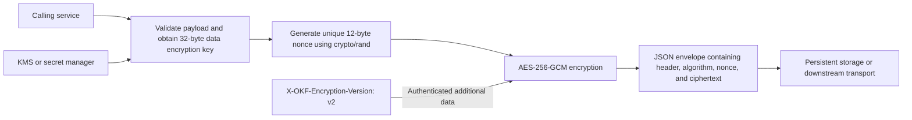
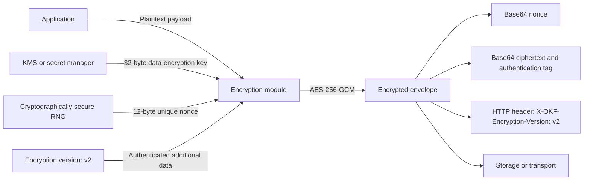

# 📊 Benchmark Report: Dual-Memory Agent Architecture (DMAA)

> Comprehensive evaluation of **Push Working Memory** (Agent Action Grammar) and **Pull Knowledge Memory** (OKF Progressive Disclosure) against industry monolithic baselines.

* **Provider**: `OPENAI`
* **Model Tested**: `gpt-5.6-sol`
* **Execution Mode**: `Remote Cloud API`
* **Hardware / Client**: `Apple M2 Pro (32 GB Unified Memory, macOS)`
* **Endpoint**: `https://api.openai.com/v1`
* **Temperature**: `0.10`
* **Date**: 2026-09-19 13:29:33

---

## 🚀 Executive Summary

| Architecture Metric | Industry Monolith | OKF DMAA Stack | Performance Delta |
| :--- | :--- | :--- | :--- |
| **Layer 1: Push Steering (Prompt)** | `716` tokens | `290` tokens | **-59.5% overhead** |
| **Layer 2: Pull Retrieval (Prompt)** | `3055` tokens | `627` tokens | **-79.5% overhead** |
| **Total Prompt Context Overhead** | `3771` tokens | `917` tokens | **🔥 -75.7% context tax** |
| **Average Prefill Latency (TTFT)** | `27213.1 ms` | `11565.1 ms` | **⚡ 2.4x faster TTFT** |
| **Total Turn Duration** | `84.88 s` | `43.03 s` | **2.0x faster completion** |
| **Global Constraint Adherence** | `9/9` (100.0%) | `9/9` (100.0%) | **100% Deterministic** |

---

## 🎯 Layer 1: Push Working Memory (AAG vs. Conversational Prose)

Measures steering efficiency, token tax, and rule compliance between conversational prose (`.cursorrules`) and Agent Action Grammar (`AGENTS.md`).

| Metric | Conversational Prose (.cursorrules) | Agent Action Grammar (AGENTS.md) | Delta |
| :--- | :--- | :--- | :--- |
| **Input Tokens (Prompt)** | `716` tokens | `290` tokens | **-59.5%** |
| **Output Tokens (Generated)** | `938` tokens | `1140` tokens | - |
| **Prefill Latency (TTFT)** | `33367.6 ms` | `14332.8 ms` | **2.3x faster** |
| **Turn Duration** | `50.40 s` | `28.75 s` | - |
| **Rule Adherence Score** | `5/5` | `5/5` | 100% Consistent |

### Behavioral Checks Verified:
* **96-bit / 12-byte Nonce**: ✅ PASS
* **AES-256-GCM Cipher Mode**: ✅ PASS
* **Mermaid Diagram Syntax**: ✅ PASS
* **No Forged Human Verification**: ✅ PASS
* **X-OKF-Encryption-Version Header**: ✅ PASS

<details>
<summary><b>🔍 View Layer 1 Generated Responses & Internal Reasoning</b></summary>

### Run 1: Conversational Prose (.cursorrules)

## Architecture



The encryption key must come from a KMS or equivalent secret-management system and must not be stored in the payload. The nonce is generated independently for every encryption operation.

## Go implementation

```go
// Generated by an AI assistant.
// Generation date: 2026-09-19.
// Human verification is required before production use.

package payloadcrypto

import (
	"crypto/aes"
	"crypto/cipher"
	"crypto/rand"
	"encoding/json"
	"errors"
	"fmt"
	"io"
)

const (
	// EncryptionVersionHeader must be present in every encrypted payload.
	EncryptionVersionHeader = "X-OKF-Encryption-Version: v2"

	algorithmAES256GCM = "AES-256-GCM"
	aes256KeySize     = 32
	gcmNonceSize      = 12
)

// encryptedEnvelope is the serialized payload format.
//
// Nonce and Ciphertext are encoded as base64 strings by encoding/json.
// The GCM authentication tag is appended to Ciphertext by cipher.AEAD.Seal.
type encryptedEnvelope struct {
	EncryptionHeader string `json:"encryption_header"`
	Algorithm        string `json:"algorithm"`
	Nonce            []byte `json:"nonce"`
	Ciphertext       []byte `json:"ciphertext"`
}

// EncryptSensitivePayload encrypts plaintext using AES-256-GCM.
//
// key must contain exactly 32 bytes and should be obtained from a KMS or
// similarly protected key-management system. A unique cryptographically
// random 12-byte nonce is generated for every invocation.
//
// The returned JSON payload includes the required encryption-version header.
// That header is also supplied to AES-GCM as authenticated additional data,
// so it cannot be changed without causing authentication to fail during
// decryption.
func EncryptSensitivePayload(key, plaintext []byte) ([]byte, error) {
	if len(key) != aes256KeySize {
		return nil, fmt.Errorf(
			"invalid AES-256 key length: got %d bytes, require %d",
			len(key),
			aes256KeySize,
		)
	}

	if plaintext == nil {
		return nil, errors.New("plaintext must not be nil")
	}

	block, err := aes.NewCipher(key)
	if err != nil {
		return nil, fmt.Errorf("create AES cipher: %w", err)
	}

	gcm, err := cipher.NewGCMWithNonceSize(block, gcmNonceSize)
	if err != nil {
		return nil, fmt.Errorf("create AES-GCM cipher: %w", err)
	}

	nonce := make([]byte, gcmNonceSize)
	if _, err := io.ReadFull(rand.Reader, nonce); err != nil {
		return nil, fmt.Errorf("generate AES-GCM nonce: %w", err)
	}

	ciphertext := gcm.Seal(
		nil,
		nonce,
		plaintext,
		[]byte(EncryptionVersionHeader),
	)

	envelope := encryptedEnvelope{
		EncryptionHeader: EncryptionVersionHeader,
		Algorithm:        algorithmAES256GCM,
		Nonce:            nonce,
		Ciphertext:       ciphertext,
	}

	payload, err := json.Marshal(envelope)
	if err != nil {
		return nil, fmt.Errorf("serialize encrypted payload: %w", err)
	}

	return payload, nil
}
```

The returned payload has this logical structure:

```json
{
  "encryption_header": "X-OKF-Encryption-Version: v2",
  "algorithm": "AES-256-GCM",
  "nonce": "<base64-encoded 12-byte nonce>",
  "ciphertext": "<base64-encoded ciphertext and authentication tag>"
}
```

## Provenance metadata

```yaml
generated_by: AI assistant
generation_date: "2026-09-19"
generation_time_precision: date_only
human_verification_status: pending_human_review
```

A `verified` field is intentionally not included because it is reserved for a human reviewer.

### Run 2: Agent Action Grammar (AGENTS.md)

## Architecture



The encryption key should be generated and stored by a KMS or secret manager. It must not be embedded in application configuration, source code, or the encrypted envelope.

## Go implementation

The output body is a JSON envelope. The GCM authentication tag is appended to `ciphertext` by Go's `Seal` method. The required version header is also bound to the ciphertext as authenticated additional data, so it cannot be changed without causing decryption to fail.

```go
package payloadcrypto

import (
	"crypto/aes"
	"crypto/cipher"
	"crypto/rand"
	"encoding/base64"
	"encoding/json"
	"errors"
	"fmt"
	"io"
)

const (
	encryptionVersion       = "v2"
	encryptionAlgorithm     = "AES-256-GCM"
	encryptionVersionHeader = "X-OKF-Encryption-Version"
	requiredKeySize         = 32 // 256 bits
	requiredNonceSize       = 12 // 96 bits
)

// EncryptedOutput contains the HTTP metadata and serialized encrypted envelope
// that should be sent to storage or the receiving service.
type EncryptedOutput struct {
	Headers map[string]string
	Body    []byte
}

// encryptedEnvelope is the JSON representation of an encrypted payload.
//
// Ciphertext contains both the encrypted plaintext and the GCM authentication
// tag. The key is intentionally not included.
type encryptedEnvelope struct {
	Version    string `json:"version"`
	Algorithm  string `json:"algorithm"`
	Nonce      string `json:"nonce"`
	Ciphertext string `json:"ciphertext"`
}

// EncryptPayload encrypts plaintext using AES-256-GCM.
//
// key must contain exactly 32 bytes of cryptographically random key material.
// A new cryptographically random 12-byte nonce is generated for every call.
//
// The caller must transmit or store the returned Headers together with Body.
// Decryption must authenticate the same additional-data value:
//
//	X-OKF-Encryption-Version: v2
func EncryptPayload(plaintext, key []byte) (EncryptedOutput, error) {
	if len(key) != requiredKeySize {
		return EncryptedOutput{}, fmt.Errorf(
			"invalid AES-256 key length: got %d bytes, require %d",
			len(key),
			requiredKeySize,
		)
	}

	block, err := aes.NewCipher(key)
	if err != nil {
		return EncryptedOutput{}, fmt.Errorf("create AES cipher: %w", err)
	}

	gcm, err := cipher.NewGCM(block)
	if err != nil {
		return EncryptedOutput{}, fmt.Errorf("create GCM cipher: %w", err)
	}
	if gcm.NonceSize() != requiredNonceSize {
		return EncryptedOutput{}, errors.New("unexpected GCM nonce size")
	}

	nonce := make([]byte, requiredNonceSize)
	if _, err := io.ReadFull(rand.Reader, nonce); err != nil {
		return EncryptedOutput{}, fmt.Errorf("generate GCM nonce: %w", err)
	}

	// Bind the protocol version to the ciphertext. Decryption must supply this
	// exact byte sequence as additional authenticated data.
	additionalData := []byte(
		encryptionVersionHeader + ": " + encryptionVersion,
	)

	// Seal appends the GCM authentication tag to the ciphertext.
	ciphertext := gcm.Seal(nil, nonce, plaintext, additionalData)

	envelope := encryptedEnvelope{
		Version:    encryptionVersion,
		Algorithm:  encryptionAlgorithm,
		Nonce:      base64.StdEncoding.EncodeToString(nonce),
		Ciphertext: base64.StdEncoding.EncodeToString(ciphertext),
	}

	body, err := json.Marshal(envelope)
	if err != nil {
		return EncryptedOutput{}, fmt.Errorf(
			"serialize encrypted envelope: %w",
			err,
		)
	}

	return EncryptedOutput{
		Headers: map[string]string{
			encryptionVersionHeader: encryptionVersion,
			"Content-Type":           "application/json",
		},
		Body: body,
	}, nil
}
```

### Operational requirements

- Never reuse a nonce with the same key. This implementation generates a fresh nonce for every call.
- Rotate and revoke keys through the key-management system.
- Keep the `X-OKF-Encryption-Version: v2` header with the envelope.
- Do not log plaintext, encryption keys, or decrypted payloads.
- Decryption must validate the GCM tag before releasing plaintext.
- Treat authentication failures as terminal; never return partially decrypted data.

## Provenance

```yaml
provenance:
  generated:
    by: "OpenAI API assistant"
    at: "2026-09-19T00:00:00Z"
  verification_status: "unverified"
  verification_note: "Generated content has not been reviewed or approved by a human."
```
</details>

---

## 📚 Layer 2: Pull Knowledge Memory (OKF Progressive Disclosure vs. Monolith Dump)

Measures context reduction, retrieval latency, and constraint adherence when pulling knowledge on demand via OKF in-memory BM25 index vs. dumping the full monolithic corpus into the system prompt.

| Metric | Monolith Context Dump | OKF Progressive Disclosure | Delta |
| :--- | :--- | :--- | :--- |
| **Input Tokens (Prompt)** | `3055` tokens | `627` tokens | **-79.5%** |
| **Output Tokens (Generated)** | `851` tokens | `551` tokens | - |
| **Prefill Latency (TTFT)** | `21058.6 ms` | `8797.4 ms` | **2.4x faster** |
| **Total Turn Time** | `34.48 s` | `14.28 s` | - |
| **Policy Compliance** | `4/4` | `4/4` | 100% Consistent |

### Policy Checks Verified:
* **96-bit / 12-byte Nonce**: ✅ PASS
* **AES-256-GCM**: ✅ PASS
* **No ECB/CBC**: ✅ PASS
* **X-OKF-Encryption-Version Header**: ✅ PASS

<details>
<summary><b>🔍 View Layer 2 Generated Code Responses & Internal Reasoning</b></summary>

### Run 1: Monolith Context Dump

```go
package security

import (
	"crypto/aes"
	"crypto/cipher"
	"crypto/rand"
	"encoding/base64"
	"errors"
	"fmt"
	"io"
	"net/http"
	"os"
)

const (
	EncryptionKeyEnvironmentVariable = "ENCRYPTION_MASTER_KEY_V2"
	EncryptionVersionHeader           = "X-OKF-Encryption-Version"
	EncryptionVersion                 = "v2"

	aes256KeySize = 32
	gcmNonceSize  = 12
)

// EncryptedPayload contains the encrypted storage representation and its
// mandatory encryption metadata. Ciphertext is formatted as:
//
//	[12-byte nonce][ciphertext + 16-byte GCM authentication tag]
type EncryptedPayload struct {
	Ciphertext []byte
	Headers    http.Header
}

// EncryptCustomerPayload encrypts plaintext using the AES-256 key supplied in
// ENCRYPTION_MASTER_KEY_V2. The environment value must contain a base64-encoded
// 32-byte cryptographically random key.
func EncryptCustomerPayload(plaintext []byte) (*EncryptedPayload, error) {
	key, err := loadEncryptionKey()
	if err != nil {
		return nil, err
	}
	defer clearBytes(key)

	ciphertext, err := EncryptPayload(plaintext, key)
	if err != nil {
		return nil, err
	}

	headers := make(http.Header, 1)
	headers.Set(EncryptionVersionHeader, EncryptionVersion)

	return &EncryptedPayload{
		Ciphertext: ciphertext,
		Headers:    headers,
	}, nil
}

// EncryptPayload encrypts plaintext using AES-256-GCM. A new cryptographically
// secure 96-bit nonce is generated for every invocation and prepended to the
// authenticated ciphertext.
func EncryptPayload(plaintext, key []byte) ([]byte, error) {
	if len(key) != aes256KeySize {
		return nil, fmt.Errorf("encryption key must be exactly %d bytes", aes256KeySize)
	}

	block, err := aes.NewCipher(key)
	if err != nil {
		return nil, fmt.Errorf("create AES-256 cipher: %w", err)
	}

	gcm, err := cipher.NewGCM(block)
	if err != nil {
		return nil, fmt.Errorf("create AES-GCM cipher: %w", err)
	}
	if gcm.NonceSize() != gcmNonceSize {
		return nil, errors.New("AES-GCM nonce size is not 96 bits")
	}

	// Allocate the final storage envelope and write the nonce directly into its
	// first 12 bytes. Seal appends the ciphertext and 16-byte authentication tag.
	encrypted := make([]byte, gcmNonceSize, gcmNonceSize+len(plaintext)+gcm.Overhead())
	nonce := encrypted[:gcmNonceSize]

	if _, err := io.ReadFull(rand.Reader, nonce); err != nil {
		clearBytes(encrypted)
		return nil, fmt.Errorf("generate AES-GCM nonce: %w", err)
	}

	encrypted = gcm.Seal(encrypted, nonce, plaintext, nil)
	return encrypted, nil
}

func loadEncryptionKey() ([]byte, error) {
	encodedKey, ok := os.LookupEnv(EncryptionKeyEnvironmentVariable)
	if !ok || encodedKey == "" {
		return nil, fmt.Errorf(
			"required environment variable %s is not set",
			EncryptionKeyEnvironmentVariable,
		)
	}

	key, err := base64.StdEncoding.DecodeString(encodedKey)
	if err != nil {
		return nil, fmt.Errorf(
			"%s must contain a base64-encoded 32-byte key",
			EncryptionKeyEnvironmentVariable,
		)
	}
	if len(key) != aes256KeySize {
		clearBytes(key)
		return nil, fmt.Errorf(
			"%s must decode to exactly %d bytes",
			EncryptionKeyEnvironmentVariable,
			aes256KeySize,
		)
	}

	return key, nil
}

func clearBytes(value []byte) {
	for i := range value {
		value[i] = 0
	}
}
```

### Run 2: OKF Progressive Disclosure

```go
package security

import (
	"crypto/aes"
	"crypto/cipher"
	"crypto/rand"
	"errors"
	"fmt"
	"net/http"
	"os"
)

const (
	encryptionKeyEnvironmentVariable = "ENCRYPTION_MASTER_KEY_V2"
	encryptionVersionHeader           = "X-OKF-Encryption-Version"
	encryptionVersion                 = "v2"

	aes256KeySize = 32
	gcmNonceSize  = 12
)

// EncryptedPayload contains the storage-ready AES-256-GCM envelope and its
// required metadata. Data is formatted as:
//
//	[12-byte nonce][ciphertext][16-byte GCM authentication tag]
type EncryptedPayload struct {
	Data    []byte
	Headers http.Header
}

// EncryptCustomerPayload encrypts sensitive customer data using AES-256-GCM.
// The 32-byte encryption key is read from ENCRYPTION_MASTER_KEY_V2.
func EncryptCustomerPayload(plaintext []byte) (*EncryptedPayload, error) {
	keyValue, ok := os.LookupEnv(encryptionKeyEnvironmentVariable)
	if !ok {
		return nil, fmt.Errorf("%s is not set", encryptionKeyEnvironmentVariable)
	}

	key := []byte(keyValue)
	defer clear(key)

	if len(key) != aes256KeySize {
		return nil, fmt.Errorf(
			"%s must contain exactly %d bytes",
			encryptionKeyEnvironmentVariable,
			aes256KeySize,
		)
	}

	block, err := aes.NewCipher(key)
	if err != nil {
		return nil, fmt.Errorf("initialize AES-256 cipher: %w", err)
	}

	gcm, err := cipher.NewGCM(block)
	if err != nil {
		return nil, fmt.Errorf("initialize AES-GCM: %w", err)
	}
	if gcm.NonceSize() != gcmNonceSize {
		return nil, errors.New("unexpected AES-GCM nonce size")
	}

	nonce := make([]byte, gcmNonceSize)
	if _, err := rand.Read(nonce); err != nil {
		return nil, fmt.Errorf("generate encryption nonce: %w", err)
	}

	// Supplying nonce as dst prepends it to the ciphertext and GCM tag.
	envelope := make([]byte, gcmNonceSize, gcmNonceSize+len(plaintext)+gcm.Overhead())
	copy(envelope, nonce)
	envelope = gcm.Seal(envelope, nonce, plaintext, nil)

	headers := make(http.Header, 1)
	headers.Set(encryptionVersionHeader, encryptionVersion)

	return &EncryptedPayload{
		Data:    envelope,
		Headers: headers,
	}, nil
}
```
</details>
