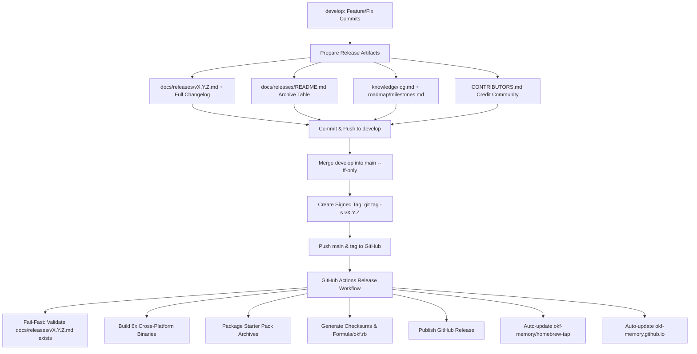

# OKF Agent Memory — Release Playbook

This playbook defines the canonical, step-by-step procedure for releasing new versions of **OKF Agent Memory** (`okf`).

---

## 1. Release Architecture & CI/CD Flow

OKF Agent Memory releases follow GitFlow with strict, automated GitHub Actions CI/CD gates:



---

## 2. Master File Inventory for Releases

Whenever a new release is prepared, verify and update the following files:

| File Path | Requirement | Purpose |
| :--- | :--- | :--- |
| **`docs/releases/v<X.Y.Z>.md`** | **MANDATORY (CI Gate)** | Release notes with highlights, detailed changes, community thanks, and mandatory `### Full Changelog` link. CI will fail-fast if absent! |
| **`docs/releases/README.md`** | **MANDATORY** | Release history table. Append new row with version, date, and 1-line summary. |
| **`knowledge/log.md`** | **MANDATORY** | Append dated entry `## YYYY-MM-DD` recording the release and any concept updates. |
| **`knowledge/roadmap/milestones.md`** | **MANDATORY** | Update phase count and ensure the completed phase row accurately reflects deliverables. |
| **`CONTRIBUTORS.md`** | **MANDATORY** | Credit all users who contributed code, bug reports, issue reproductions, or architectural feedback. |
| **`docs/security/SECURITY_AUDIT.md`** | Optional | Update if security audit protocols, Jules templates, or invariants changed. |
| **`README.md`** | Optional | Update if release archive links, version badges, or CLI examples need alignment. |

---

## 3. Pre-Release Quality Gates

Run these commands locally before tagging to ensure 100% clean state:

```bash
# 1. Format code
make fmt

# 2. Synchronize active skills to embedded bootstrap assets
make sync-assets

# 3. Run complete verification pipeline (vet, lint, unit & integration tests, strict OKF bundle checks)
make check

# 4. Strict OKF knowledge validation with drift detection
./bin/okf validate knowledge --strict --drift

# 5. Verify git working directory is clean
git status
```

---

## 4. Step-by-Step Release Workflow

### Step 1: Author Release Notes & Update Files (on `develop`)

Always author release materials on **`develop`** first:

```bash
git checkout develop
git pull origin develop

# 1. Author docs/releases/vX.Y.Z.md (use template below)
# 2. Update docs/releases/README.md
# 3. Update knowledge/log.md and knowledge/roadmap/milestones.md
# 4. Update CONTRIBUTORS.md

# Validate knowledge bundle
make validate

# Commit release documentation
git add docs/releases/ docs/releases/README.md knowledge/ CONTRIBUTORS.md
git commit -m "chore(release): prepare release notes and changelog for vX.Y.Z"
git push origin develop
```

### Step 2: Merge into `main` and Create Signed Tag

```bash
# Switch to main and fast-forward
git checkout main
git pull origin main
git merge --ff-only develop
git push origin main

# Create cryptographically signed tag
git tag -s vX.Y.Z -m "Release vX.Y.Z: <Short Title>"

# Push tag to GitHub (triggers CI/CD)
git push origin vX.Y.Z
```

> [!IMPORTANT]
> Always use `git tag -s` (or `git tag -a`) to sign the release tag with your GPG/SSH key. Unsigned lightweight tags should not be used for production releases.

---

## 5. Standard Release Notes Template

Save as `docs/releases/v<X.Y.Z>.md`:

```markdown
# Release v<X.Y.Z> – <Release Title>

<1-2 paragraph executive summary explaining the primary focus, key improvements, and user impact of this release.>

---

### 1. <Major Feature / Focus Area 1>
* **<Component>:** <Details of change, issue reference e.g. (#123)>.
* **<Impact>:** <What this unlocks for users/agents>.

### 2. <Major Feature / Focus Area 2>
* **<Component>:** <Details of change>.

### 3. Storage & Conformance Hardening
* **<Atomic Operations / Validation>:** <Details>.

### 4. Developer Experience & CI
* **<Testing / Tooling>:** <Details>.

### 5. Community & Special Thanks
* A huge thank you to <contributor> ([@handle](https://github.com/handle)) for <concrete contribution, reproduction, or PR> (#<issue>).

### Full Changelog
See commits between `v<PREV_VER>...v<X.Y.Z>` on [GitHub](https://github.com/okf-memory/okf-agent-memory/compare/v<PREV_VER>...v<X.Y.Z>).
```

---

## 6. Pre-Release Checklist (Copy-Pasteable)

Copy this checklist into release tracking issues or PR descriptions:

```markdown
### Pre-Release Checklist for v<X.Y.Z>

#### Code Quality & Verification
- [ ] `make fmt` run and verified clean
- [ ] `make sync-assets` run (embedded bootstrap skills match active `.agents/skills`)
- [ ] `make check` passes with 0 errors (vet, lint, unit tests, integration tests)
- [ ] `okf validate knowledge --strict --drift` passes with 0 errors, 0 warnings, 0 broken links

#### Release Documentation & Metadata
- [ ] `docs/releases/v<X.Y.Z>.md` created with highlights and details
- [ ] `docs/releases/v<X.Y.Z>.md` contains `### Full Changelog` linking `v<PREV>...v<CURR>`
- [ ] `docs/releases/README.md` updated with new release entry row
- [ ] `knowledge/log.md` contains dated release entry
- [ ] `knowledge/roadmap/milestones.md` updated with phase status and deliverables
- [ ] `CONTRIBUTORS.md` updated with credit for all issue reporters and PR contributors

#### Git & Tagging
- [ ] Changes committed to `develop` and pushed
- [ ] `main` fast-forwarded to `develop` (`git merge --ff-only develop`)
- [ ] Signed tag created: `git tag -s v<X.Y.Z> -m "Release v<X.Y.Z>: <Title>"`
- [ ] Tag pushed to GitHub: `git push origin v<X.Y.Z>`

#### Post-Release Automation Verification
- [ ] GitHub Actions Release workflow completed successfully
- [ ] GitHub Release page contains all 6 binaries, starter packs, checksums, and Homebrew formula
- [ ] `okf-memory/homebrew-tap` updated with new `Formula/okf.rb`
- [ ] `okf-memory.github.io` updated with new version
- [ ] Direct `go install github.com/okf-memory/okf-agent-memory/cmd/okf@v<X.Y.Z>` verified
```

---

## 7. Post-Release Verification & Distribution Checks

After pushing the tag, verify all automated distribution channels:

1. **GitHub Actions Workflow:**
   - Check `https://github.com/okf-memory/okf-agent-memory/actions`
   - Confirm all steps in `.github/workflows/release.yml` succeed.

2. **GitHub Release Assets:**
   - Confirm assets on `https://github.com/okf-memory/okf-agent-memory/releases/tag/v<X.Y.Z>`:
     - `okf-darwin-arm64`, `okf-darwin-amd64`
     - `okf-linux-arm64`, `okf-linux-amd64`
     - `okf-windows-arm64.exe`, `okf-windows-amd64.exe`
     - `okf-starter-pack-v<X.Y.Z>.tar.gz` & `.zip`
     - `checksums.txt`
     - `Formula/okf.rb`

3. **Homebrew Tap:**
   ```bash
   brew update
   brew upgrade okf
   okf version
   ```

4. **Direct Go Install:**
   ```bash
   go install github.com/okf-memory/okf-agent-memory/cmd/okf@v<X.Y.Z>
   okf version
   ```

---

## 8. Hotfix Protocol

If an urgent regression is discovered in production:

1. **Branch off `main`**:
   ```bash
   git checkout -b hotfix/vX.Y.Z main
   ```
2. **Implement fix & regression test** in `pkg/okf/`.
3. **Run quality gates**: `make check`.
4. **Follow the checklist**: Author `docs/releases/vX.Y.Z.md` with hotfix notes.
5. **Merge to `main`**, tag with signed tag `git tag -s vX.Y.Z`, and push.
6. **Backport to `develop`**:
   ```bash
   git checkout develop
   git merge main
   git push origin develop
   ```
