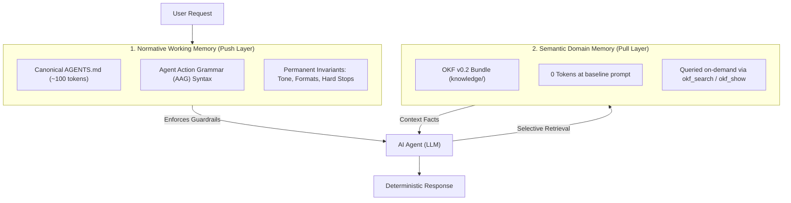

# Dual-Memory Agent Architecture (DMAA) & Agent Action Grammar (AAG)

The **Dual-Memory Agent Architecture (DMAA)** resolves the context-bloat and attention-drift dilemma in AI coding agents through a 2-layer cognitive model.[^dmaa-rfc]

## Layer 1: Normative Working Memory (Push Layer)
* **Location:** `AGENTS.md` at repository root (symlinked to `CLAUDE.md`, `.cursorrules`, etc.).
* **Language:** **Agent Action Grammar (AAG)** — dense ASCII operators (`=>`, `ASSERT`, `!`, `MUST`) replacing natural language prose (~78% token reduction).[^best-practices]
* **Budget:** Strictly capped at **100–150 tokens**.
* **Responsibility:** Invariant formatting rules, communication style, and bootstrap triggers to search OKF memory.

## Layer 2: Semantic Domain Memory (Pull Layer)
* **Location:** `knowledge/` OKF v0.2 bundle.
* **Footprint:** **0 tokens** in initial system prompt.
* **Responsibility:** Architecture decisions, data models, domain knowledge, and subsystem governance rules retrieved on-demand via `okf_search`.

## Inter-Concept Connections
* Extends the core principles in [principles](principles.md) with compact agent instruction standards.
* Complements the 5-layer architecture in [architecture/layers](../architecture/layers.md).

[^dmaa-rfc]: RFC Dual-Memory Agent Architecture (DMAA)
[^best-practices]: Best Practices for Agent Instructions in AGENTS.md

# Related Concepts
- [Core Memory Principles & Agent Contract](principles.md): Specializes behavioral invariants into two cognitive memory layers
- [5-Layer System Architecture](../architecture/layers.md): Defines Layer 1 push working memory and Layer 2 pull domain memory
